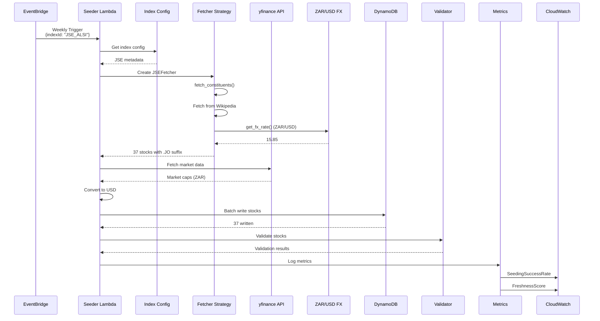
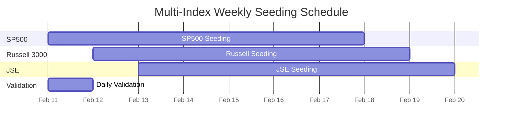
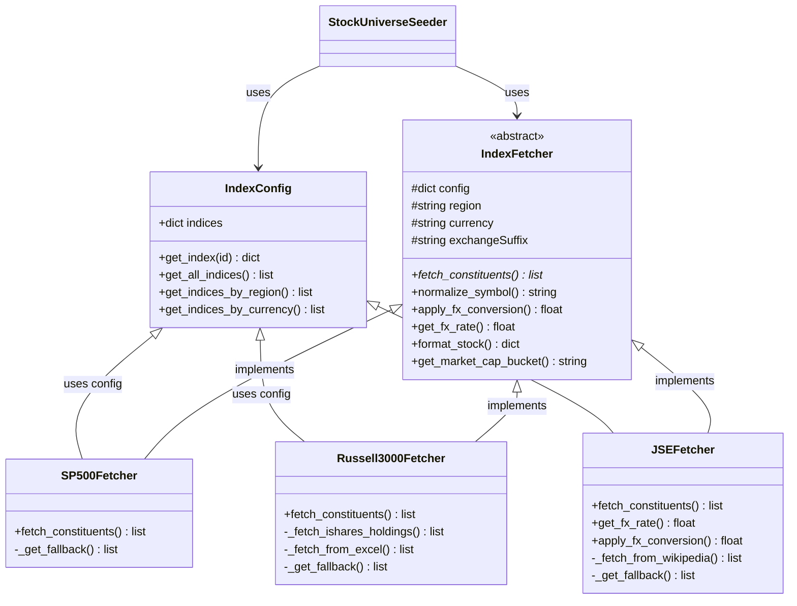

# New AWS Infrastructure - Multi-Index Stock Universe

## Architecture Overview

```mermaid
graph TB
    subgraph "Client Layer"
        WEB[Web Browser<br/>S3 + CloudFront]
    end

    subgraph "API Gateway Layer"
        APIGW[Amazon API Gateway<br/>REST API]
        APIGW --> |GET| SEARCH[Stock Search<br/>/api/stocks/search]
        APIGW --> |GET| FILTER[Stock Filter<br/>/api/stocks/filter]
        APIGW --> |GET| POPULAR[Popular Stocks<br/>/api/stocks/popular]
        APIGW --> |GET| INDICES[Multi-Index<br/>/api/stocks/indices]
        APIGW --> |GET| INDEX_DETAIL[Index Details<br/>/api/stocks/indices/{id}]
        APIGW --> |GET| INDEX_STOCKS[Index Stocks<br/>/api/stocks/indices/{id}/stocks]
    end

    subgraph "Lambda Functions"
        STOCKAPI[Stock API<br/>Lambda Handler]
        UNIVERSEAPI[Stock Universe<br/>API Manager]
        UNIVERSESEED[Stock Universe<br/>Seeder + Fetchers]
        VALIDATOR[Stock Validator<br/>Module]
        METRICS[Stock Metrics<br/>CloudWatch Publisher]
    end

    WEB --> APIGW

    SEARCH --> STOCKAPI
    FILTER --> UNIVERSEAPI
    POPULAR --> UNIVERSEAPI
    INDICES --> UNIVERSEAPI
    INDEX_DETAIL --> UNIVERSEAPI
    INDEX_STOCKS --> UNIVERSEAPI

    subgraph "Multi-Index Fetcher Strategy Pattern"
        CONFIG[Index Config Registry<br/>index_config.py]
        BASE[Index Fetcher Base<br/>base.py]
        SP500[SP500 Fetcher<br/>Wikipedia]
        RUSSELL[Russell 3000 Fetcher<br/>iShares/Excel]
        JSE[JSE Fetcher<br/>Wikipedia + FX]

        CONFIG --> SP500
        CONFIG --> RUSSELL
        CONFIG --> JSE
        BASE --> SP500
        BASE --> RUSSELL
        BASE --> JSE
    end

    subgraph "Data Sources"
        WIKI[Wikipedia<br/>S&P 500 / JSE]
        ISHARES[iShares ETF<br/>Holdings]
        YFINANCE[yfinance API<br/>Market Data]
        FX[ZAR/USD<br/>FX Rate]
    end

    SP500 --> WIKI
    RUSSELL --> ISHARES
    JSE --> WIKI
    JSE --> FX
    UNIVERSESEED --> YFINANCE

    subgraph "DynamoDB - stock-universe Table"
        TABLE[stock-universe]
        GSI1[region-index<br/>PK: region<br/>SK: symbol]
        GSI2[index-id-index<br/>PK: indexId<br/>SK: symbol]
        GSI3[currency-index<br/>PK: currency<br/>SK: symbol]
        GSI4[status-index<br/>PK: isActive<br/>SK: symbol]
        GSI5[sector-index<br/>PK: sector<br/>SK: symbol]
        GSI6[marketcap-index<br/>PK: marketCapBucket<br/>SK: symbol]

        TABLE --> GSI1
        TABLE --> GSI2
        TABLE --> GSI3
        TABLE --> GSI4
        TABLE --> GSI5
        TABLE --> GSI6
    end

    UNIVERSEAPI --> |Query| GSI2
    UNIVERSEAPI --> |Query| GSI1
    UNIVERSEAPI --> |Query| GSI3
    UNIVERSEAPI --> |Scan| TABLE
    STOCKAPI --> TABLE

    UNIVERSESEED --> CONFIG
    UNIVERSESEED --> |Write| TABLE
    UNIVERSESEED --> VALIDATOR
    UNIVERSESEED --> METRICS

    subgraph "EventBridge Schedules"
        E1[SP500Weekly<br/>rate(7 days)]
        E2[RussellWeekly<br/>rate(7 days)]
        E3[JSEWeekly<br/>rate(7 days)]
        E4[DailyValidation<br/>rate(1 day)]
    end

    E1 --> UNIVERSESEED
    E2 --> UNIVERSESEED
    E3 --> UNIVERSESEED
    E4 --> UNIVERSESEED

    VALIDATOR --> YFINANCE
    METRICS --> CLOUDWATCH[CloudWatch<br/>Metrics]

    subgraph "CloudWatch Monitoring"
        LOGS[Lambda Logs]
        METRICS1[Freshness Score]
        METRICS2[Data Quality Score]
        METRICS3[Seeding Results]
        METRICS4[Stock Counts]
    end

    UNIVERSESEED --> LOGS
    METRICS --> METRICS1
    METRICS --> METRICS2
    METRICS --> METRICS3
    METRICS --> METRICS4

    style CONFIG fill:#e1f5ff
    style BASE fill:#ffe1e1
    style SP500 fill:#e1ffe1
    style RUSSELL fill:#e1ffe1
    style JSE fill:#e1ffe1
    style GSI1 fill:#ffecd9
    style GSI2 fill:#ffecd9
    style GSI3 fill:#ffecd9
    style GSI4 fill:#ffecd9
```

---

## DynamoDB Schema Detail

```mermaid
erDiagram
    STOCK_UNIVERSE {
        string symbol PK
        string name
        string sector
        string subSector
        string industry
        string region "NEW"
        string currency
        string exchange
        string exchangeSuffix "NEW"
        string indexId "NEW"
        array indexIds "NEW"
        decimal marketCap
        decimal marketCapUSD "NEW"
        string marketCapBucket
        timestamp lastUpdated
        timestamp lastValidated "NEW"
        boolean isActive "NEW"
        string dataSource "NEW"
        string country
        string headquarters
    }

    STOCK_UNIVERSE }|--|| REGION_INDEX : "region-index GSI"
    STOCK_UNIVERSE }|--|| INDEX_ID_INDEX : "index-id-index GSI"
    STOCK_UNIVERSE }|--|| CURRENCY_INDEX : "currency-index GSI"
    STOCK_UNIVERSE }|--|| STATUS_INDEX : "status-index GSI"

    REGION_INDEX {
        string region PK "NEW"
        string symbol SK
    }

    INDEX_ID_INDEX {
        string indexId PK "NEW"
        string symbol SK
    }

    CURRENCY_INDEX {
        string currency PK "NEW"
        string symbol SK
    }

    STATUS_INDEX {
        boolean isActive PK "NEW"
        string symbol SK
    }
```

---

## Data Flow: Seeding Process



---

## Query Patterns via GSIs

```mermaid
graph LR
    subgraph "Query Examples"
        Q1[Get all US stocks<br/>region = 'US']
        Q2[Get S&P 500 stocks<br/>indexId = 'SP500']
        Q3[Get ZAR stocks<br/>currency = 'ZAR']
        Q4[Get delisted stocks<br/>isActive = false]
        Q5[Filter by currency + index<br/>currency='ZAR'<br/>indexId='JSE_ALSI']
    end

    Q1 --> GSI1[region-index]
    Q2 --> GSI2[index-id-index]
    Q3 --> GSI3[currency-index]
    Q4 --> GSI4[status-index]
    Q5 --> SCAN[Scan with filters<br/>until GSIs available]

    GSI1 --> RESULT1[Fast O(log n)]
    GSI2 --> RESULT2[Fast O(log n)]
    GSI3 --> RESULT3[Fast O(log n)]
    GSI4 --> RESULT4[Fast O(log n)]
    SCAN --> RESULT5[Slower O(n) -<br/>fallback until multi-key GSI]
```

---

## EventBridge Schedule Timeline



---

## Fetcher Strategy Pattern



---

## API Endpoint Map

```mermaid
mindmap
  root((API Gateway))
    /api/stocks/search
      q=query
      region=US|ZA
      indexId=SP500|JSE_ALSI
      currency=USD|ZAR
    /api/stocks/filter
      sector=Technology
      minCap=1e9
      maxCap=100e9
      marketCapBucket=mega
      region=US|ZA
      indexId=SP500
      currency=USD|ZAR
    /api/stocks/popular
      limit=10
    /api/stocks/indices
      GET - List all indices
    /api/stocks/indices/{id}
      GET - Index details
      id=SP500|RUSSELL3000|JSE_ALSI
    /api/stocks/indices/{id}/stocks
      GET - Stocks in index
      limit=100
    /api/stocks/symbol/{symbol}
      GET - Single stock
```

---

## Key Changes Summary

### New Components
| Component | Purpose |
|-----------|---------|
| `index_config.py` | Central registry for 3 indices |
| `index_fetchers/` | Strategy pattern for data sources |
| `stock_validator.py` | Data quality validation |
| `stock_metrics.py` | CloudWatch metrics publisher |
| 4 GSIs | Efficient querying by region/index/currency/status |
| 4 EventBridge schedules | Staggered seeding + daily validation |

### New DynamoDB Fields
| Field | Type | Description |
|-------|------|-------------|
| `region` | string | Geographic region (US, ZA) |
| `indexId` | string | Primary index membership |
| `indexIds` | array | All index memberships |
| `marketCapUSD` | decimal | USD-normalized market cap |
| `currency` | string | Base currency (USD, ZAR) |
| `exchangeSuffix` | string | .JO for JSE stocks |
| `isActive` | boolean | Still trading flag |
| `lastValidated` | timestamp | Last quality check |
| `dataSource` | string | Data system name |
